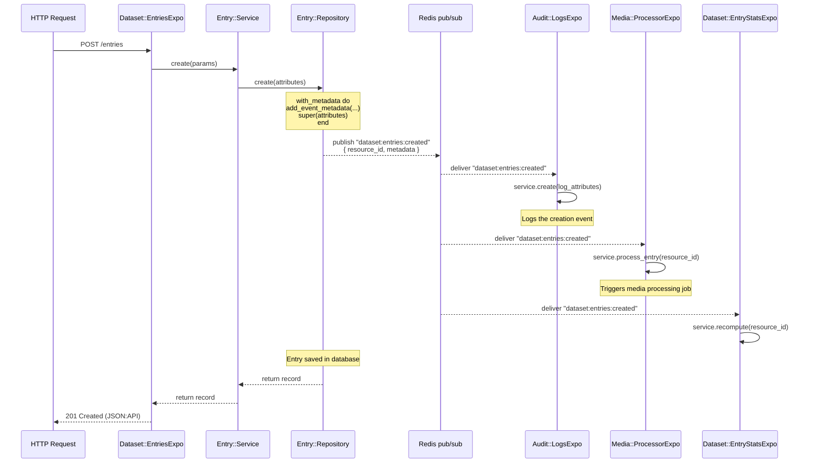

# Event System

## Overview

IDAH uses asynchronous inter-service communication via **Redis pub/sub**, managed by the **Verse Event Manager** (`em` in configuration). Events are **published by repositories** when state changes occur (CRUD operations on resources), and **subscribed to by expositions** which delegate to their service layer for handling.

This decoupling means services react to events without direct HTTP coupling. For example, when the IAM service creates an account, the Setting service creates default settings automatically — without IAM knowing about Setting at all.

### Architecture

```
┌─────────────┐     publish     ┌───────────┐     deliver     ┌──────────────┐
│  Repository │ ──────────────> │  Redis    │ ──────────────> │  Exposition  │
│  (Publisher)│                 │  pub/sub  │                 │ (Subscriber) │
└─────────────┘                 └───────────┘                 └──────┬───────┘
                                                                     │
                                                                     ▼
                                                              ┌──────────────┐
                                                              │   Service    │
                                                              │ (Handler)    │
                                                              └──────────────┘
```

### Key Principles

| Principle | Detail |
|-----------|--------|
| **Publishers are repositories** | Repositories own data state changes; they emit events when records are created, updated, or deleted |
| **Subscribers are expositions** | Expositions listen for events and delegate to services — no business logic in expositions |
| **Resource constants = channel names** | `Resource::Iam::Accounts` string value `"iam:accounts"` is both the JSON:API type identifier and the event channel prefix |
| **No direct inter-service calls** | Services communicate through events (async) or the HTTP API client (sync), never directly |

---

## Channel Naming

### Resource Events (Standard CRUD)

Resource events follow this pattern:

```
<resource_constant>:<action>
```

- **Action**: One of `created`, `updated`, `deleted` — the default CRUD lifecycle events
- **Resource constant**: Defined in `common/lib/resource/` as string constants
- **Full event name**: `"iam:accounts:created"`, `"dataset:entries:updated"`, `"media:medias:deleted"`

These events are automatically published by the Verse repository framework when `super` is called inside `create`, `update!`, or `delete!`.

#### Resource Constants Reference

| Module | Constant | Channel String |
|--------|----------|----------------|
| `Resource::Iam` | `Accounts` | `"iam:accounts"` |
| | `AccountSessions` | `"iam:account_sessions"` |
| | `AccountAuths` | `"iam:account_auths"` |
| | `Organizations` | `"iam:organizations"` |
| | `ApiKeys` | `"iam:api_keys"` |
| `Resource::Dataset` | `Projects` | `"dataset:projects"` |
| | `ProjectMembers` | `"dataset:project_members"` |
| | `Datasets` | `"dataset:datasets"` |
| | `Entries` | `"dataset:entries"` |
| | `Annotations` | `"dataset:annotations"` |
| | `NoteFeeds` | `"dataset:note_feeds"` |
| | `NoteComments` | `"dataset:note_comments"` |
| | `EntryStats` | `"dataset:entry_stats"` |
| `Resource::Media` | `Jobs` | `"media:jobs"` |
| | `Medias` | `"media:medias"` |
| `Resource::Setting` | `Settings` | `"setting:settings"` |
| | `AccountSettings` | `"setting:account_settings"` |
| | `Plugins` | `"setting:plugins"` |
| `Resource::Audit` | `Logs` | `"audit:logs"` |
| `Resource::Sync` | `Jobs` | `"sync:jobs"` |
| | `Exports` | `"sync:exports"` |

### Custom Events

Custom events use ad-hoc channel strings that are **not tied to a resource constant**:

| Channel | Purpose | Publisher | Subscriber |
|---------|---------|-----------|------------|
| `"notification:email"` | Send an email via SMTP | Any service (via `Service::Notification.email`) | Notification service |
| `"iam:account:login"` | Track account login events | IAM account session repository | Audit service |
| `"setting:plugins:restart_required"` | Signal a plugin reload | Setting service | Plugin system exposition |

Custom channels are published via direct `Verse.publish` calls and subscribed to with `on_event`.

---

## Publishing Events

### From Repositories — Standard Pattern

Every repository that publishes resource events must set `self.resource`:

```ruby
# app/<service>/app/model/<entity>.rb
module Account
  class Repository < Verse::Sequel::Repository
    self.table = "accounts"
    self.resource = Resource::Iam::Accounts
  end
end
```

Once `self.resource` is set, the standard CRUD methods (`create`, `update!`, `delete!`) **automatically publish** events on the channel `<resource>:created`, `<resource>:updated`, and `<resource>:deleted`.

#### Metadata Enrichment with `with_metadata`

The `with_metadata` block enriches the event payload with context that subscribers can inspect:

```ruby
def create(attributes)
  with_metadata do
    add_event_metadata(
      project_id: attributes[:project_id],
      dataset_id: attributes[:dataset_id]
    )

    super(attributes)  # triggers "<resource>:created" event automatically
  end
end

def update!(id, attributes, scope: scoped(:update))
  with_metadata do
    record = find!(id)

    add_event_metadata(
      project_id: attributes[:project_id] || record.project_id,
      dataset_id: id
    )

    super(id, attributes, scope:)  # triggers "<resource>:updated" event
  end
end

def delete!(id)
  with_metadata do
    record = find!(id)

    add_event_metadata(
      project_id: record.project_id,
      dataset_id: id
    )

    super(id)  # triggers "<resource>:deleted" event
  end
end
```

Common metadata fields include:

| Metadata Field | Purpose |
|----------------|---------|
| `actor_account_id` | Who performed the action (auto-injected by `auth_context.metadata[:id]`) |
| `actor_account_email` | Email of acting user |
| `actor_account_role_name` | Role of acting user |
| `organization_id` | Organization scoping for subscribers |
| `project_id` | Project scoping for subscribers |
| `dataset_id` | Dataset scoping for subscribers |
| `entry_id` | Entry scoping for subscribers |

#### Decorator-based Custom Events (`event(name:)`)

For non-CRUD events, use the `event(name:)` decorator and surround internal data mutations with `no_event`:

```ruby
event(name: "submitted")
def submit(id, attributes)
  entry = find!(id)

  add_event_metadata(
    project_id: attributes[:project_id] || entry.project_id,
    dataset_id: attributes[:dataset_id] || entry.dataset_id,
    entry_id: id,
    submission_type: entry.wf_step
  )

  no_event do
    transaction do
      # Use read scope since submitters may only have read access
      update!(id, attributes, scope: scoped(:read))
    end
  end
end
```

The `event(name:)` decorator publishes on `<resource>:<name>` — in this case `"dataset:entries:submitted"`. The `no_event` block suppresses the automatic event that `update!` would otherwise emit.

#### Event Suppression (`no_event`)

Use `no_event` to suppress automatic CRUD event publishing:

```ruby
event(name: "completed")
def completed!(dataset_id, progress)
  no_event do
    update!(dataset_id, { progress: progress, status: "completed" })
  end
end

event(name: "in_progress")
def in_progress!(dataset_id, progress)
  no_event do
    update!(dataset_id, { progress: progress, status: "in_progress" })
  end
end
```

Here, `completed!` and `in_progress!` emit `"dataset:datasets:completed"` and `"dataset:datasets:in_progress"` but suppress the automatic `"dataset:datasets:updated"` that `update!` would otherwise fire.

#### Metadata-only Custom Events (without `event(name:)`)

For custom events that need metadata but aren't tied to a specific method decorator, combine `with_metadata` and `no_event` on standard methods:

```ruby
event(name: "assigned")
def assign(id, attributes)
  entry = find!(id)

  add_event_metadata(
    project_id: attributes[:project_id] || entry.project_id,
    dataset_id: attributes[:dataset_id] || entry.dataset_id,
    entry_id: id
  )

  no_event do
    transaction do
      update!(id, attributes)
    end
  end
end
```

### Manual Publishing (`Verse.publish`)

For custom channels or events originating outside a repository, use `Verse.publish` directly:

```ruby
# From a repository method
Verse.publish(
  "iam:account:login",
  {
    account_id: account.id,
    account_email: account.email,
    account_role: account.role_name,
    ip: ip,
    user_agent: user_agent,
    at: at,
  }
)
```

The email notification helper in `common/lib/service/notification.rb` uses this pattern:

```ruby
module Service
  module Notification
    SEND_EMAIL_CHANNEL = "notification:email"

    def email(title:, category:, type: nil, to: nil, **params)
      raise ArgumentError, "to email must be provided" if to.nil?

      hash = {
        account_email: to,
        title:,
        category:,
        type:
      }.merge(params)

      Verse.publish(SEND_EMAIL_CHANNEL, hash)
    end
  end
end
```

### `Verse.publish_resource_event` (Test Helper)

In specs, use `Verse.publish_resource_event` to simulate incoming events:

```ruby
Verse.publish_resource_event(
  resource_type: Resource::Iam::Accounts,
  resource_id: account_id,
  event: "deleted",
  payload: { resource_id: account_id }
)
```

---

## Event Message Structure

When an exposition receives an event, the `message` object contains:

```ruby
message.content
# => {
#   resource_id: <String>,           # Primary resource ID
#   metadata: {                       # Auth context / extra context
#     actor_account_id: ...,
#     actor_account_email: ...,
#     actor_account_role_name: ...,
#     organization_id: ...,
#     project_id: ...,
#     ...
#   },
#   args: [{ ... }]                  # Only on "updated" events — the update payload
# }
```

For events published via `event(name:)` decorator or `with_metadata`, the metadata is automatically populated from the auth context and any `add_event_metadata` calls.

For custom events published via `Verse.publish`, the content is exactly the hash passed as the second argument.

Accessing fields:

```ruby
expose on_resource_event(Resource::Iam::Accounts, "deleted")
def on_account_deleted
  account_id = message.content[:resource_id]  # primary key
end

expose on_resource_event(Resource::Dataset::ProjectMembers, "updated")
def on_project_member_disabled
  account_id = message.content.dig(:metadata, :project_member_account_id)
  disabled_at = message.content.dig(:args, 0, :disabled_at)
  # ...
end
```

---

## Subscribing to Events

### From Expositions

Expositions subscribe to events using two DSL methods:

| Method | Purpose |
|--------|---------|
| `on_resource_event(resource_constant, event_name)` | Subscribe to a resource CRUD or custom event |
| `on_event(channel_string)` | Subscribe to a custom event channel |

#### `on_resource_event`

Used for events published through the repository framework (auto-CRUD + `event(name:)` decorator):

```ruby
# Subscribe to iam:accounts:created
expose on_resource_event(Resource::Iam::Accounts, "created")
def on_account_created
  service.create_default_settings(message.content[:resource_id])
end

# Subscribe to iam:accounts:deleted
expose on_resource_event(Resource::Iam::Accounts, "deleted")
def on_account_deleted
  account_id = message.content[:resource_id]
  service.cleanup(account_id)
end

# Subscribe to a custom repository event
expose on_resource_event(Resource::Dataset::Entries, "submitted")
def on_entry_submitted
  return unless message.content[:metadata][:submission_type]
  service.process_submission(message.content[:resource_id])
end
```

Using string constants vs symbols for the event name — either works:

```ruby
expose on_resource_event(Resource::Iam::Accounts, "created")     # string
expose on_resource_event(Resource::Iam::Accounts, :created)      # symbol
```

For subscribing to multiple events on the same resource, use dynamic iteration:

```ruby
# app/audit/app/expo/logs_expo.rb
%w[created updated deleted].each do |event|
  expose on_resource_event(Resource::Iam::Accounts, event)
  def on_account_event
    service.create(log_attributes(message:))
  end
end
```

#### `on_event`

Used for custom channels that aren't resource-tied:

```ruby
expose on_event("notification:email")
def on_send_email
  content = message.content
  notify = Verse::JsonApi::Struct.new(content)
  service.send_email(notify.account_email, notify)
end
```

### Using Resource Constants for Event Names

Always use the `Resource::Service::Entity` constant when subscribing to resource events. Hardcoded strings like `"iam:accounts"` work at runtime but bypass the benefits of a single source of truth:

```ruby
# ✅ Correct
expose on_resource_event(Resource::Iam::Accounts, "created")

# ❌ Avoid — hardcoded strings are brittle
expose on_resource_event("iam:accounts", "created")
```

### Block Form with Description

You can pass a block to `on_resource_event` for documentation:

```ruby
expose on_resource_event(Resource::Media::Jobs, "created") do
  desc "When a job is created, signal the scheduler to wake up and try to process it."
end
def on_job_created
  SCHEDULER.signal
end
```

---

## Key Event Subscribers

### Audit Service

The Audit service is the most comprehensive event subscriber. It listens to nearly every resource event and logs them to the `logs` table for compliance and tracing.

| Resource | Events | Notes |
|----------|--------|-------|
| `Resource::Iam::Accounts` | `created`, `updated`, `deleted`, `logged_in` | Login event uses custom event name |
| `Resource::Iam::AccountSessions` | `logged_out` | Logout event |
| `Resource::Iam::Organizations` | `created`, `updated`, `deleted` | |
| `Resource::Dataset::Projects` | `created`, `updated`, `deleted` | Augments with `organization_id` |
| `Resource::Dataset::ProjectMembers` | `created`, `updated`, `deleted` | Augments with `project_id` |
| `Resource::Dataset::Datasets` | `created`, `updated`, `deleted` | Augments with org + project + dataset IDs |
| `Resource::Dataset::Entries` | `created`, `updated`, `deleted`, `assigned`, `unassigned`, `submitted` | Skips entries from background workers (no `actor_account_id`) |
| `Resource::Media::Medias` | `created`, `updated`, `deleted` | Skips media from background workers |

### Notification Service

Subscribes to the `"notification:email"` custom channel. Emails are sent via SMTP.

```ruby
# app/notification/app/expo/emails_expo.rb
expose on_event(Service::Notification::SEND_EMAIL_CHANNEL)
def on_send_email
  content = message.content
  raise Verse::Error::ValidationFailed, "Missing account_email in email content" unless content[:account_email]
  notify = Verse::JsonApi::Struct.new(content)
  service.send_email(notify.account_email, notify)
end
```

Any service can trigger an email via:

```ruby
Service::Notification.email(
  to: "user@example.com",
  title: "Welcome!",
  category: "onboarding",
  type: "welcome_email",
  template_params: { name: "John" }
)
```

### Setting Service

| Event | Handler |
|-------|---------|
| `iam:accounts:created` | Creates default settings for the new account |
| `iam:accounts:deleted` | Cleans up settings when account is removed |

### Media Service

| Event | Handler |
|-------|---------|
| `dataset:entries:created` | Triggers media processing for new entries (`ProcessorExpo#on_entry_created`) |
| `media:jobs:created` | Signals the scheduler to wake and process pending jobs (`JobsExpo#on_job_created`) |
| `media:jobs:rescheduled` | Signals the scheduler to re-process a rescheduled job |

### Dataset Service

| Event | Handler |
|-------|---------|
| `iam:organizations:deleted` | Cleanup organization-scoped data |
| `dataset:project_members:updated` | Unassign entries when a member is disabled (checks `disabled_at` in args) |
| `iam:accounts:deleted` | Removes all project memberships for the deleted account |
| `iam:accounts:updated` | Disables project memberships when account is disabled (`enabled: false`) |
| `media:jobs:completed` | Marks entries as `ready` when media processing succeeds |
| `media:jobs:errored` | Marks entries as `processing_error` when media processing fails |
| `dataset:entries:submitted` | Recomputes entry stats on submission |
| `dataset:entries:errored` | Recomputes entry stats on error |

### IAM Service

| Event | Handler |
|-------|---------|
| `iam:organizations:deleted` | Removes organization from account role scopes |

### Plugin System

| Event | Handler |
|-------|---------|
| `setting:plugins:restart_required` | Reloads the specified plugin at runtime |

```ruby
# common/lib/plugin_system/exposition.rb
expose on_resource_event(Resource::Setting::Plugins, :restart_required)
def restart_plugin
  PluginSystem.restart_plugin(*message.values_at(:plugin_name, :plugin_version))
end
```

---

## Event Flow Diagram

The following sequence illustrates a complete event flow across services when an entry is created in the Dataset service:



---

## Configuration

### Backend Selection

The event manager adapter is configured per-environment:

```yaml
# config.yml (production / development)
em:
  adapter: redis
```

```yaml
# config.test.yml (test)
em:
  adapter: local
```

All services follow this same pattern:

| Config File | Adapter |
|-------------|---------|
| `config.yml` | `redis` — connects to Redis for inter-service pub/sub |
| `config.development.yml` | Inherits `redis` from base config (Redis required for dev) |
| `config.test.yml` | `local` — inline, synchronous, no Redis dependency |

### Test Environment Behavior

When the adapter is set to `local`:

- Events are published and delivered synchronously within the same process
- No Redis connection is required
- Tests are deterministic — event handlers fire before the test assertion continues
- This is the standard configuration for all service test suites

```yaml
# app/audit/config/config.test.yml
em:
  adapter: local
# app/dataset/config/config.test.yml
em:
  adapter: local
# app/iam/config/config.test.yml
em:
  adapter: local
# app/media/config/config.test.yml
em:
  adapter: local
# app/notification/config/config.test.yml
em:
  adapter: local
# app/setting/config/config.test.yml
em:
  adapter: local
# app/sync/config/config.test.yml
em:
  adapter: local
```

### Testing Event-Driven Behavior

Specs use `Verse.publish_resource_event` to simulate incoming events:

```ruby
RSpec.describe LogsExpo do
  describe "account events" do
    let(:resource_type) { Resource::Iam::Accounts }
    let(:resource_id) { SecureRandom.uuid }

    %w[created updated deleted].each do |event|
      it "logs #{event} events" do
        expect(service).to receive(:create)

        Verse.publish_resource_event(
          resource_type:,
          resource_id:,
          event:,
          payload: { resource_id: }
        )
      end
    end
  end
end
```

Key considerations for testing event subscribers:

1. **Synchronous delivery**: With `adapter: local`, handlers fire inline — no async waiting
2. **Mock at service level**: Expect service method calls, not exposition internals
3. **Payload completeness**: Include `args` for `updated` events and `metadata` when the handler checks it
4. **Conditional logic**: Test both branches — e.g., when `disabled_at` is present and when it's absent

---

## Common Patterns & Pitfalls

### Do: Enrich Events with Contextual Metadata

Always include enough context in `add_event_metadata` so subscribers can operate without additional DB queries:

```ruby
# ✅ Good — subscriber gets organization_id without a lookup
add_event_metadata(
  organization_id: record.organization_id,
  project_id: record.project_id
)
```

### Do: Use `no_event` for Internal Mutations

When a custom event (`event(name:)`) performs data changes, wrap those changes in `no_event` to avoid double-publishing:

```ruby
event(name: "assigned")
def assign(id, attributes)
  # ...
  no_event do
    update!(id, attributes)  # suppress automatic "updated" event
  end
end
```

### Do: Guard Event Handlers with Early Returns

Event handlers should be defensive — check for the conditions that make the event relevant:

```ruby
expose on_resource_event(Resource::Dataset::Entries, "submitted")
def on_entry_submitted
  return unless message.content[:metadata][:submission_type]  # Only real submissions

  service.process_submission(message.content[:resource_id])
end
```

### Don't: Put Business Logic in Expositions

The exposition's job is to receive the event and delegate. Business logic belongs in services:

```ruby
# ❌ Wrong
expose on_resource_event(Resource::Iam::Accounts, "created")
def on_account_created
  Setting::Record.create(account_id: message.content[:resource_id], ...)
end

# ✅ Correct
expose on_resource_event(Resource::Iam::Accounts, "created")
def on_account_created
  service.create_default_settings(message.content[:resource_id])
end
```

### Don't: Publish Events from Services Directly (For Resource Events)

Resource events should be published from repositories using `self.resource`, `event(name:)`, and `with_metadata`. Services should call repository methods which emit events:

```ruby
# ❌ Wrong — service bypassing repository
class Service
  def create(attributes)
    record = repo.create(attributes)
    Verse.publish("dataset:entries:created", { resource_id: record.id })
  end
end

# ✅ Correct — service calls repository, repository publishes
class Service
  def create(attributes)
    repo.create(attributes)
  end
end
```

Manual `Verse.publish` is appropriate for **custom channels** that have no associated repository (e.g., `"notification:email"`, `"iam:account:login"`).

### Don't: Bypass Auth Scoping in Event Handlers

Event handlers run in the service context. When they need to perform data mutations, use `use_system_repo` only when unavoidable:

```ruby
# Event handlers typically read — use scoped queries when writing
expose on_resource_event(Resource::Iam::Accounts, "deleted")
def on_account_deleted
  # Uses system repo if no auth context is available
  service.cleanup(message.content[:resource_id])
end
```

---

## Summary

| Concept | Mechanism | Example |
|---------|-----------|---------|
| **Auto CRUD events** | `self.resource` + `super` in `create`/`update!`/`delete!` | `"dataset:entries:created"` |
| **Custom resource events** | `event(name:)` decorator on repository method | `"dataset:entries:submitted"` |
| **Metadata enrichment** | `with_metadata` + `add_event_metadata` blocks | Actor info, org/project scoping |
| **Event suppression** | `no_event` block inside decorator methods | Prevent double-publishing |
| **Manual publishing** | `Verse.publish(channel, payload)` | `"notification:email"`, `"iam:account:login"` |
| **Resource event subscription** | `on_resource_event(Resource::X, "event")` in exposition | `on_resource_event(Resource::Iam::Accounts, "created")` |
| **Custom event subscription** | `on_event("channel:string")` in exposition | `on_event("notification:email")` |
| **Test helper** | `Verse.publish_resource_event(...)` in specs | Simulate incoming resource events |
| **Test adapter** | `em: adapter: local` in `config.test.yml` | Synchronous, in-process delivery |
