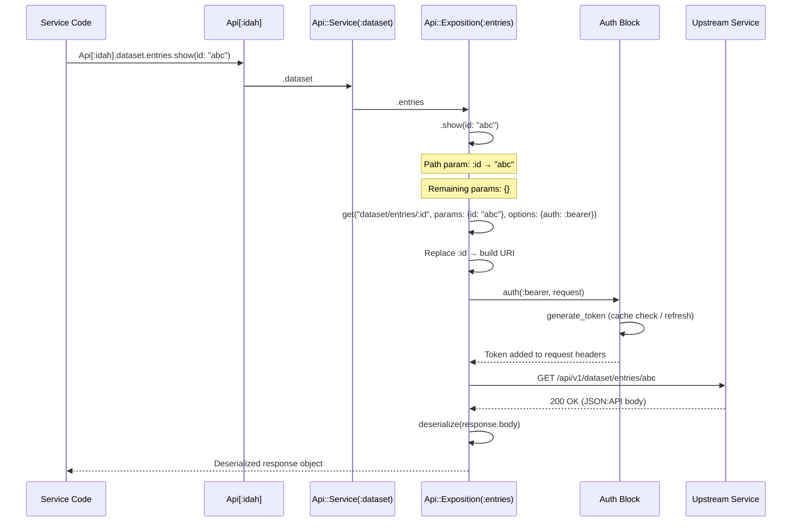

# Inter-Service API Client

## Overview

The Inter-Service API Client is a custom HTTP client defined in `common/lib/api.rb` that enables Ruby services to communicate with each other internally. Instead of each service managing its own HTTP requests and auth, the API client provides a centralized, declarative way to register and call endpoints across services.

**Key features:**

- **JWT bearer token authentication** with automatic refresh (60-second buffer before expiry)
- **Declarative endpoint registration** — one file per service under `common/lib/api/__map__/`
- **Fluent call syntax** — `Api[:idah].service.exposition.method(params)`
- **Automatic pagination** via the `Api.all` helper
- **Path parameter substitution** — `"entries/:id"` replaces `:id` from params
- **Nested query string building** — `filter: { email: "..." }` becomes `filter[email]=...`
- **Multipart streaming** for file uploads via `MultipartStream`

---

## Architecture

```
Api[:idah]                ← Singleton provider instance (per provider name)
│
├── Api::Service(:iam)    ← One per upstream service (dataset, iam, media, setting)
│   ├── base_path          ← URL prefix, e.g. "iam" → base_url + "iam/"
│   │
│   └── Api::Exposition(:accounts)  ← One per entity/resource
│       └── method(:index)          ← Endpoint implementation (registered block)
│
├── Api::Exposition(:auth) ← Another exposition under the same service
│
└── Api::Exposition(:organizations) ← And another
```

### Classes

| Class | File | Responsibility |
|-------|------|----------------|
| `Api` | `common/lib/api.rb` | Singleton registry, provider setup, auth configuration, `Api.all` pagination helper |
| `Api::Service` | `common/lib/api/service.rb` | Groups expositions under a logical service name; holds `base_path` |
| `Api::Exposition` | `common/lib/api/exposition.rb` | Low-level HTTP methods (`get`, `post`, `put`, `patch`, `delete`) and endpoint registration |
| `Api::MultipartStream` | `common/lib/api/multipart_stream.rb` | Streaming body for multipart/form-data uploads |

---

## Provider Setup (`__include__.rb`)

The file `common/lib/api/__map__/__include__.rb` is required first (via `Dir.glob` ordering) and configures the shared `Api[:idah]` provider. It is the single point where base URL, service paths, and authentication are wired.

```ruby
# common/lib/api/__map__/__include__.rb

require "verse/json_api"

# Include deserializer into Exposition so all registered blocks can call `deserialize`
Api::Exposition.include(Verse::JsonApi::Deserializer)

# Base URL for all requests
Api[:idah].base_url = [ENV.fetch("IDAH_URL"), "api/v1/"].join("/")

# Register services with their URL path prefixes
Api[:idah].register_service(:media).base_path   = "media"
Api[:idah].register_service(:iam).base_path     = "iam"
Api[:idah].register_service(:dataset).base_path = "dataset"

# Bearer token authentication with auto-refresh
Api[:idah].add_auth(:bearer) do |request|
  token = generate_token
  request["Authorization"] = "Bearer #{token}"
end

# Token generation with caching and auto-refresh
def generate_token
  # Return cached token if still valid (60-second buffer before expiry)
  if @service_token && @service_token_expires_at &&
     (@service_token_expires_at - Time.now.to_i) >= 60
    return @service_token
  end

  # Fetch service credentials from config
  credentials = Verse::Config.config.extra_fields.fetch(:credentials) do
    raise "Credentials for API not found in config file."
  end

  # Login to IAM to get a fresh token
  output = Api[:idah].iam.auth.login(
    email: credentials.fetch(:account),
    password: credentials.fetch(:password)
  )

  token = output.meta&.dig(:token)
  @service_token_expires_at = JSON.parse(
    Base64.decode64(token.split(".")[1])
  )["exp"] if token
  @service_token = token

  token
end
```

### What the setup achieves

| Concern | How it's configured |
|---------|---------------------|
| **Base URL** | `Api[:idah].base_url = ...` — all requests go here |
| **Service routing** | `register_service(:dataset).base_path = "dataset"` — prepends `/dataset` to paths |
| **JSON:API deserialization** | `Verse::JsonApi::Deserializer` mixed into `Api::Exposition` — makes `deserialize` available |
| **Auth** | `add_auth(:bearer)` — registers a named auth provider that injects the `Authorization` header |
| **Token lifecycle** | `generate_token` caches the JWT and refreshes it when < 60 seconds from expiry |

> **Note:** Auth is not automatic — it must be explicitly enabled per request via `options: { auth: :bearer }`. The login endpoint (`iam.auth.login`) intentionally omits auth since there is no token yet.

---

## Registration Pattern

Endpoints are registered in files under `common/lib/api/__map__/`, one file per upstream service. Each registration call binds a block to a `(service, exposition, method_name)` triple.

### Signature

```ruby
Api[:idah].register(:service_name, :exposition_name, :method_name) do |params|
  # Inside the block, `self` is the Api::Exposition instance
  output = get("path/to/resource", params:, options: { auth: :bearer })
  deserialize output.body
end
```

The block's `self` is the `Api::Exposition` instance, so HTTP methods (`get`, `post`, etc.) and `deserialize` are available directly.

### Path parameter substitution

Use `:param_name` placeholders in the path string. They are replaced by matching keys in the params hash and removed before the remaining params become the query string.

```ruby
Api[:idah].register(:dataset, :entries, :show) do |id:, **opts|
  output = get(
    "dataset/entries/:id",           # :id is pulled from params
    params: { id:, **opts },
    options: { auth: :bearer }
  )
  deserialize output.body
end
```

Calling `Api[:idah].dataset.entries.show(id: "abc", include: "owner")` issues a `GET` to `dataset/entries/abc?include=owner`.

### Real-world example — dataset service

```ruby
# common/lib/api/__map__/dataset.rb

Api[:idah].register(:dataset, :annotations, :index) do |params = {}|
  output = get(
    "dataset/annotations",
    params:,                               # becomes ?filter[...]=&page[...]=
    options: { auth: :bearer }
  )
  deserialize output.body
end

Api[:idah].register(:dataset, :entries, :update) do |id:, **attributes|
  output = patch(
    "dataset/entries/:id",
    params: {
      id:,
      data: {
        type: Resource::Dataset::Entries,  # JSON:API resource type constant
        attributes:
      }
    },
    options: { auth: :bearer }
  )
  deserialize output.body
end
```

### Paginated endpoints (index_all convention)

Endpoints that fetch all records across pages use the `index_all` suffix and wrap the call in `Api.all`:

```ruby
Api[:idah].register(:dataset, :entries, :index_all) do |params = {}|
  Api.all(params) do
    output = get(
      "dataset/entries",
      params:,
      options: { auth: :bearer }
    )
    deserialize(output.body)
  end
end
```

---

## Usage in Service Code

Once registered, endpoints are called fluently through the provider:

```ruby
# Simple call — get a single entry
entry = Api[:idah].dataset.entries.show(id: "0195b3a0-...")

# With nested filter params
accounts = Api[:idah].iam.accounts.index(
  filter: { email: "test@example.com" }
)

# With pagination
members = Api[:idah].dataset.project_members.index(
  filter: { project_id: "0195b3a1-..." },
  page: { size: 100 }
)
```

### How method calls resolve

1. `Api[:idah]` → the singleton `Api` provider instance
2. `.dataset` → `Api::Service` for the `:dataset` service (dynamically defined singleton method)
3. `.entries` → `Api::Exposition` for `:entries` under that service (dynamically defined singleton method)
4. `.show(id: ...)` → the block registered with `register(:dataset, :entries, :show)` — called on the `Exposition` instance

### Special cases

**Login (no auth):**

```ruby
Api[:idah].register(:iam, :auth, :login) do |email:, password:|
  output = post(
    "iam/auth/login",
    params: { email:, password: }
    # No options[:auth] — login is unauthenticated
  )
  deserialize output.body
end
```

**File download (raw body, no deserialization):**

```ruby
Api[:idah].register(:media, :medias, :files) do |resource:, **opts|
  output = get(
    "media/medias/files/:resource",
    options: { auth: :bearer },
    params: { resource:, **opts }
  )
  output.body   # Return raw body instead of deserializing
end
```

**File attributes (uses Resource constant and JSON:API format):**

```ruby
Api[:idah].register(:iam, :accounts, :create) do |attributes:|
  output = post(
    "iam/accounts",
    body: { data: { type: "iam:accounts", attributes: } },
    options: { auth: :bearer }
  )
  deserialize output.body
end
```

---

## Pagination Helper (`Api.all`)

The `Api.all` class method provides automatic pagination for endpoints that return paginated collections. It wraps a block and iterates over pages until all records are fetched.

### Signature

```ruby
def self.all(params = {}, &block)
```

### How it works

1. **Default params**: `page[size]` defaults to `1000`, `page[number]` defaults to `1`
2. **Iteration**: Uses `Verse::Util::Iterator.chunk_iterator` to advance `page[number]` on each call
3. **Termination**: When a page returns fewer items than `page[size]`, the next iteration receives `nil` and stops

### Detailed flow

```ruby
Api.all(params) do
  output = get("dataset/projects", params:, options: { auth: :bearer })
  deserialize(output.body)
end
```

| Step | `page[number]` | `page[size]` | Block returns | Action |
|------|----------------|--------------|---------------|--------|
| 1 | 1 | 1000 | 1000 records | Continue to page 2 |
| 2 | 2 | 1000 | 1000 records | Continue to page 3 |
| 3 | 3 | 1000 | 250 records | Page < size → set `break_next_page` |
| 4 | 4 | 1000 | *skipped* | Returns `nil` — iterator stops |

The `all` method wraps the results in an iterator that yields chunks, so the caller receives a flat enumerable of all records across all pages.

### When to use it

- When you need **all** records matching a filter (no manual page management)
- Convention: name the registered endpoint `index_all` to distinguish from single-page `index`

### When NOT to use it

- When you only need the first page
- When you need fine-grained control over pagination parameters
- When the upstream service does not support pagination

---

## HTTP Methods

The `Api::Exposition` class provides five HTTP verb methods. They all delegate to the private `execute_request` method.

### Method signatures

```ruby
def get(path,    headers: {}, params: {}, options: {})
def post(path,   headers: {}, params: {}, options: {})
def put(path,    headers: {}, params: {}, options: {})
def patch(path,  headers: {}, params: {}, options: {})
def delete(path, headers: {}, params: {}, options: {})
```

### Request lifecycle

1. **Path parameter extraction** — `:param_name` segments are matched and replaced from `params`
2. **URI building** — base URL + service base path (if applicable) + given path
3. **Query string encoding** — for `GET`/`DELETE`, remaining params become the query string
4. **Request creation** — `Net::HTTP` request object is built
5. **Body encoding** — for `POST`/`PUT`/`PATCH`, body is set based on content type
6. **Authentication** — if `options[:auth]` is set, the auth block is called
7. **Execution** — HTTP request is sent (SSL verification is disabled in development)

### Parameter handling by HTTP method

| Method | Path params | Remaining params become |
|--------|-------------|------------------------|
| `GET` | Replaced from `params` | Query string (`?key=val&filter[x]=y`) |
| `DELETE` | Replaced from `params` | Query string |
| `POST` | Replaced from `params` | Request body (JSON or form-encoded) |
| `PUT` | Replaced from `params` | Request body |
| `PATCH` | Replaced from `params` | Request body |

### Body encoding

The `set_request_body` method determines body format based on content type headers:

| Content-Type header | Encoding method | Example usage |
|---------------------|-----------------|---------------|
| `application/json` (or no header + Hash params) | `params.to_json` | Standard JSON:API create/update |
| `application/x-www-form-urlencoded` | `set_form_data` | Form submissions |
| `multipart/form-data` | `MultipartStream` streaming | File uploads |

#### JSON body (default for POST/PUT/PATCH with Hash params)

```ruby
output = patch(
  "dataset/entries/:id",
  params: {
    id:,
    data: { type: Resource::Dataset::Entries, attributes: { name: "New Name" } }
  },
  options: { auth: :bearer }
)
# Body: {"data":{"type":"dataset:entries","attributes":{"name":"New Name"}}}
```

#### Multipart streaming (file uploads)

```ruby
output = post(
  "media/files/upload",
  params: { file: File.open("/path/to/image.png"), description: "Screenshot" },
  headers: { "Content-Type" => "multipart/form-data" },
  options: { auth: :bearer }
)
```

The `MultipartStream` class handles streaming uploads efficiently:
- Builds part headers (boundary, disposition, content-type)
- Streams file content in chunks via `read`
- Automatically calculates `Content-Length`
- Handles both IO objects and Rails-style uploaded files (`original_filename`, `content_type`)

### Nested query string encoding

The `to_query` method recursively builds query strings from nested hashes and arrays:

| Ruby value | Encoded query string |
|------------|---------------------|
| `{ filter: { email: "a@b.com" } }` | `filter[email]=a%40b.com` |
| `{ page: { size: 50 } }` | `page[size]=50` |
| `{ ids: ["a", "b"] }` | `ids[]=a&ids[]=b` |
| `{ filter: { status: ["open", "closed"] } }` | `filter[status][]=open&filter[status][]=closed` |

---

## Auth (Bearer Token)

### Configuration

Auth is configured via `add_auth` in `__include__.rb`:

```ruby
Api[:idah].add_auth(:bearer) do |request|
  token = generate_token
  request["Authorization"] = "Bearer #{token}"
end
```

The block receives the `Net::HTTP` request object and mutates it to add the header.

### Token lifecycle

```
                      ┌─────────────────────────┐
                      │  Call generate_token     │
                      └──────────┬──────────────┘
                                 │
                                 ▼
                 ┌───────────────────────────────┐
                 │  @service_token exists AND     │
                 │  @service_token_expires_at -   │  YES ──→ Return cached token
                 │  Time.now >= 60 seconds?       │
                 └──────────┬────────────────────┘
                            │ NO
                            ▼
           ┌────────────────────────────────────┐
           │  Read credentials from config      │
           │  (Verse::Config.config.extra_fields)│
           └────────────────┬───────────────────┘
                            │
                            ▼
           ┌────────────────────────────────────┐
           │  POST iam/auth/login                │
           │  with email + password              │
           └────────────────┬───────────────────┘
                            │
                            ▼
           ┌────────────────────────────────────┐
           │  Decode JWT, extract `exp` claim    │
           │  Cache token + exp in instance      │
           │  variables                          │
           └────────────────┬───────────────────┘
                            │
                            ▼
                     ┌───────────┐
                     │  Return   │
                     │  token    │
                     └───────────┘
```

**Key detail:** The expiration check uses a 60-second buffer. If the token expires in less than 60 seconds, it is treated as expired and a new one is fetched. This prevents edge-case race conditions where a token expires mid-request.

### Activation

Auth is **not** automatic — it must be explicitly enabled per request:

```ruby
options: { auth: :bearer }
```

This calls `Api#auth(:bearer, request)` which looks up the registered auth block and invokes it with the request. If no auth provider named `:bearer` is registered, an error is raised.

### Security notes

- Service credentials are stored in Verse configuration (`config.yml` / `config.{env}.yml`) under `extra_fields.credentials`
- JWT tokens are decoded only to read the `exp` claim — no signature verification is performed client-side
- SSL verification is disabled (`VERIFY_NONE`) for internal cluster communication in development

---

## Current API Maps

### IAM (`common/lib/api/__map__/iam.rb`)

| Service | Exposition | Method | HTTP | Path | Paginated |
|---------|-----------|--------|------|------|-----------|
| `:iam` | `:accounts` | `:index` | GET | `iam/accounts` | No |
| `:iam` | `:accounts` | `:show` | GET | `iam/accounts/:id` | No |
| `:iam` | `:accounts` | `:create` | POST | `iam/accounts` | No |
| `:iam` | `:auth` | `:login` | POST | `iam/auth/login` | No |
| `:iam` | `:auth` | `:logout` | GET | `iam/auth/logout` | No |
| `:iam` | `:organizations` | `:index` | GET | `iam/organizations` | No |

### Dataset (`common/lib/api/__map__/dataset.rb`)

| Service | Exposition | Method | HTTP | Path | Paginated |
|---------|-----------|--------|------|------|-----------|
| `:dataset` | `:annotations` | `:index` | GET | `dataset/annotations` | No |
| `:dataset` | `:annotations` | `:index_all` | GET | `dataset/annotations` | Yes (`Api.all`) |
| `:dataset` | `:entries` | `:index` | GET | `dataset/entries` | No |
| `:dataset` | `:entries` | `:show` | GET | `dataset/entries/:id` | No |
| `:dataset` | `:entries` | `:update` | PATCH | `dataset/entries/:id` | No |
| `:dataset` | `:entries` | `:index_all` | GET | `dataset/entries` | Yes (`Api.all`) |
| `:dataset` | `:datasets` | `:index` | GET | `dataset/datasets` | No |
| `:dataset` | `:datasets` | `:show` | GET | `dataset/datasets/:id` | No |
| `:dataset` | `:datasets` | `:index_all` | GET | `dataset/datasets` | Yes (`Api.all`) |
| `:dataset` | `:projects` | `:index` | GET | `dataset/projects` | No |
| `:dataset` | `:projects` | `:show` | GET | `dataset/projects/:id` | No |
| `:dataset` | `:projects` | `:index_all` | GET | `dataset/projects` | Yes (`Api.all`) |
| `:dataset` | `:project_members` | `:index` | GET | `dataset/project_members` | No |
| `:dataset` | `:project_members` | `:index_all` | GET | `dataset/project_members` | Yes (`Api.all`) |

### Media (`common/lib/api/__map__/media.rb`)

| Service | Exposition | Method | HTTP | Path | Paginated |
|---------|-----------|--------|------|------|-----------|
| `:media` | `:medias` | `:index_all` | GET | `media/medias` | Yes (`Api.all`) |
| `:media` | `:medias` | `:resource_info` | GET | `media/medias/info/:resource` | No |
| `:media` | `:medias` | `:files` | GET | `media/medias/files/:resource` | No |
| `:media` | `:jobs` | `:show` | GET | `media/jobs/:id` | No |
| `:media` | `:videos` | `:process` | POST | `media/videos/process` | No |

### Setting (`common/lib/api/__map__/setting.rb`)

| Service | Exposition | Method | HTTP | Path | Paginated |
|---------|-----------|--------|------|------|-----------|
| `:setting` | `:account_settings` | `:index` | GET | `setting/account_settings` | No |

---

## Best Practices

### 1. Use descriptive endpoint names

Follow the `resource.action` convention. Use `index` for single-page listings, `show` for single resources, `create`/`update` for mutations, and `index_all` for paginated full collections.

**Good:**
```ruby
register(:dataset, :entries, :index_all) { ... }
register(:dataset, :entries, :show) { ... }
```

**Avoid:**
```ruby
register(:dataset, :entries, :get_all_entries) { ... }  # Non-standard naming
```

### 2. Use `Api.all` for paginated resources

If the upstream endpoint supports pagination and you may need all matching records, register an `index_all` variant.

```ruby
Api[:idah].register(:dataset, :entries, :index_all) do |params = {}|
  Api.all(params) do
    output = get("dataset/entries", params:, options: { auth: :bearer })
    deserialize(output.body)
  end
end
```

### 3. Always use `auth: :bearer`

Every internal endpoint (except login) should use bearer auth. Omitting it will send unauthenticated requests that the upstream service will reject.

```ruby
options: { auth: :bearer }
```

### 4. Use `Resource::Service::Entity` constants for JSON:API type identifiers

When constructing JSON:API payload bodies, use the resource constants from `common/lib/resource/` instead of hardcoded strings.

```ruby
data: {
  type: Resource::Dataset::Entries,  # NOT "dataset:entries"
  attributes: { ... }
}
```

### 5. Include `Verse::JsonApi::Deserializer` in `__include__.rb`

This is already done in `__include__.rb`:
```ruby
Api::Exposition.include(Verse::JsonApi::Deserializer)
```

All registered blocks can then call `deserialize(output.body)` to parse JSON:API responses into structured Ruby objects.

### 6. Keep one file per service in `__map__/`

| File | Service |
|------|---------|
| `__map__/__include__.rb` | Setup (always loaded first) |
| `__map__/iam.rb` | IAM service endpoints |
| `__map__/dataset.rb` | Dataset service endpoints |
| `__map__/media.rb` | Media service endpoints |
| `__map__/setting.rb` | Setting service endpoints |

### 7. Prefer keyword arguments for path-dependent endpoints

For endpoints with path parameters, use explicit keyword arguments to make the interface clear:

```ruby
# Clear — required params are explicit
register(:dataset, :entries, :show) do |id:, **opts|
  ...
end

# Less clear — everything hidden in a hash
register(:dataset, :entries, :show) do |params = {}|
  ...
end
```

### 8. Return raw `output.body` for non-JSON:API responses

If an endpoint returns a file or non-JSON:API content, return `output.body` directly without calling `deserialize`:

```ruby
register(:media, :medias, :files) do |resource:, **opts|
  output = get("media/medias/files/:resource", ...)
  output.body  # Raw file content
end
```

### 9. Name paginated variants `index_all`

This convention makes it immediately clear which endpoints may issue multiple HTTP requests:

| Name | Behavior |
|------|----------|
| `index` | Single page fetch, returns one response |
| `index_all` | `Api.all` wrapper, iterates all pages |

### 10. Do not bypass auth for internal endpoints

Even though this is an internal HTTP client, always authenticate. The only exception is `iam.auth.login` where the service obtains its initial token.

---

## Adding a New Endpoint

Follow these steps to add a new inter-service API endpoint:

### 1. Identify the target service and exposition

- Service: `:dataset`, `:iam`, `:media`, or `:setting`
- Exposition: the entity/resource (e.g., `:entries`, `:accounts`)
- Method name: `:index`, `:show`, `:create`, `:update`, `:delete`, or `:index_all`

### 2. Open the appropriate `__map__/<service>.rb` file

### 3. Write the registration

```ruby
# In common/lib/api/__map__/dataset.rb

Api[:idah].register(
  :dataset, :entries, :create
) do |**attributes|
  output = post(
    "dataset/entries",
    params: {
      data: {
        type: Resource::Dataset::Entries,
        attributes:
      }
    },
    options: { auth: :bearer }
  )
  deserialize output.body
end
```

### 4. Use the new endpoint

```ruby
entry = Api[:idah].dataset.entries.create(
  name: "New Entry",
  dataset_id: "0195b3a2-..."
)
```

### 5. Add tests

Write RSpec tests for the new endpoint following the patterns in the service's spec directory.

---

## Error Handling

Errors are raised as `RuntimeError` strings from `execute_request`:

```ruby
if response.code.to_i >= 400
  raise "HTTP Error: #{response.code} - #{response.message}"
end
```

There is no built-in retry logic. Callers should handle exceptions where appropriate:

```ruby
begin
  entry = Api[:idah].dataset.entries.show(id: entry_id)
rescue => e
  # log and handle
end
```

Future work may introduce more granular error classes and retry with backoff for transient failures.

---

## Sequence Diagram: Endpoint Call Flow

The following diagram traces a call from service code through the entire API client stack:


