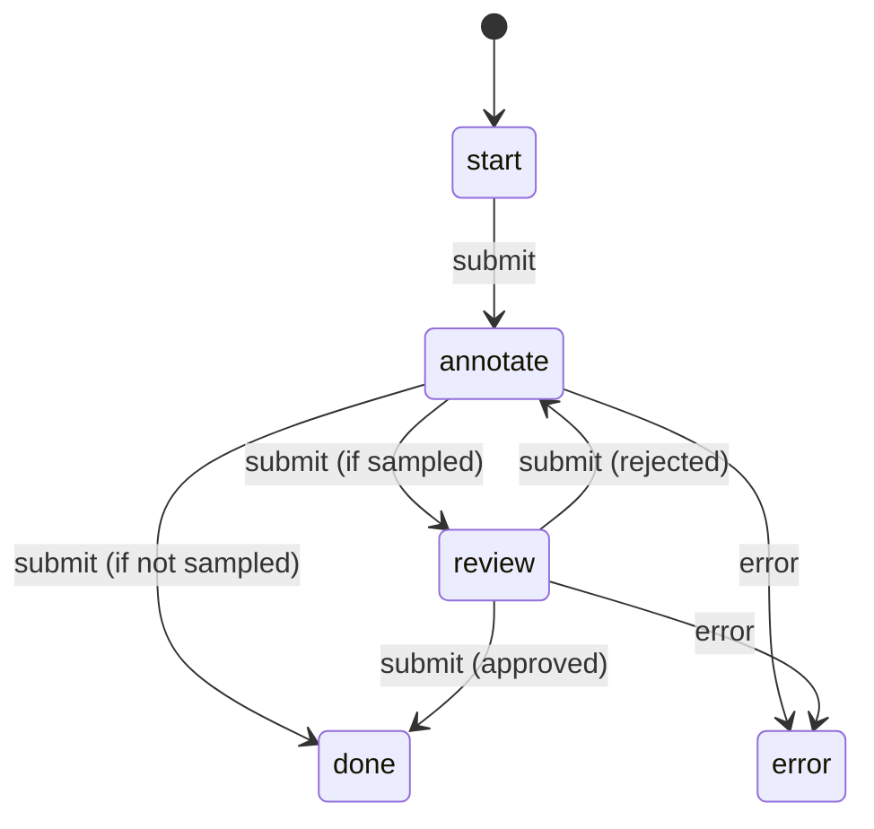

# Dataset Service

## Purpose

The Dataset Service is the core annotation management service in IDAH. It manages the entire annotation lifecycle — projects, datasets, entries, annotations, note feeds and comments, workflow state machines, and per-entry statistics. It is the largest and most feature-rich service in the platform.

This service lives at `app/dataset/` and exposes HTTP endpoints under the `/projects`, `/datasets`, `/entries`, `/annotations`, `/note_feeds`, `/note_comments`, `/project_members`, and `/entry_stats` prefixes.

---

## Models

### Project::Record

Represents a top-level organizational unit that groups datasets and team members.

```ruby
# app/dataset/app/model/project.rb
module Project
  class Record < Verse::Model::Record::Base
    type Resource::Dataset::Projects

    field :id,                     type: String, primary: true
    field :name,                   type: String
    field :description,            type: [String, NilClass]
    field :organization_id,        type: Integer, readonly: true
    field :created_by_email,       type: String, readonly: true
    field :created_at,             type: Time, readonly: true
    field :updated_at,             type: Time, readonly: true
  end
end
```

- **`organization_id`**: `bigint` — ties the project to an organization in the IAM service. Set at creation and never updated. Used for org-owner scoping in all child records.
- **`created_by_email`**: Set from `auth_context.metadata[:email]` at creation.
- **Has many**: `project_members`, `datasets`, `entries`, `annotations`, `note_feeds`.

**Scoping** (`Project::Repository#scoped`):

| Action         | Roles                              |
|----------------|------------------------------------|
| `read`         | project_owner, annotator, reviewer |
| `update/delete`| project_owner                      |
| `create`       | org_owner / admin (handled at service layer) |

---

### Dataset::Record

A collection of entries within a project, with a specific modality, labeling configuration, and workflow configuration.

```ruby
# app/dataset/app/model/dataset.rb
module Dataset
  class Record < Verse::Model::Record::Base
    type Resource::Dataset::Datasets

    field :id,                       type: String, primary: true
    field :project_id,               type: String, readonly: true
    field :name,                     type: String
    field :labels,                   type: Array
    field :modality,                 type: String, readonly: true
    field :labeling_configuration,   type: Hash
    field :workflow_configuration,   type: Hash
    field :status,                   type: String, readonly: true
    field :progress,                 type: Float, readonly: true
    field :entries_total_count,      type: Integer, readonly: true
    field :entries_completed_count,  type: Integer, readonly: true
    field :entries_in_progress_count,type: Integer, readonly: true
    field :created_at,               type: Time, readonly: true
    field :updated_at,               type: Time, readonly: true
  end
end
```

- **`modality`**: A string like `"idah-image"`, `"idah-video"`, etc. Determines which plugin handles rendering and which stat generators are used.
- **`labeling_configuration`** (JSONB): Defines categories, properties, and tool-type configs. Schema described by `LabelingConfigSchema`:
  - `properties`: Array of property definitions (id, type, format, label, required, selector).
  - `categories`: Array of category definitions (id, label, type, color).
  - Tool-type keys (e.g. `"idah-video:bounding-box"`) hold per-tool config with `values` (category IDs).
- **`workflow_configuration`** (JSONB): Controls workflow behavior. Contains:
  - `type`: The workflow class name (currently only `simple_review_annotation` is used).
  - `sample_rate`: Float between 0.0 and 1.0 — probability that an entry entering the annotate → review transition is sampled for review (default: 1.0 = always sample).
- **`entry_workflow`**: Method that returns `Workflow::SimpleReviewAnnotationWorkflow`, which is the workflow class instantiated per-entry on submit.

**Counters** (maintained via database trigger — see [Database Triggers](#database-triggers)):
- `entries_total_count`
- `entries_completed_count`
- `entries_in_progress_count`

**Statuses**: `pending`, `in_progress`, `completed`.

**Progress**: Computed as `completed_count / total_count` via `update_progress!`.

**Scoping** (`Dataset::Repository#scoped`):

| Action                | Roles                                                                                   |
|-----------------------|-----------------------------------------------------------------------------------------|
| `read`                | project_owner (all), annotator (only datasets with assigned entries), reviewer (assigned entries + unassigned entries in review step) |
| `create/update/delete`| project_owner                                                                           |

---

### Entry::Record

Individual data items within a dataset that flow through the annotation workflow.

```ruby
# app/dataset/app/model/entry.rb
module Entry
  class Record < Verse::Model::Record::Base
    type Resource::Dataset::Entries

    field :id,              type: String, primary: true
    field :project_id,      type: String, readonly: true
    field :dataset_id,      type: String, readonly: true
    field :resource,        type: String
    field :name,            type: String
    field :priority,        type: Integer
    field :wf_step,         type: String
    field :status,          type: String
    field :job_id,          type: String
    field :assigned_to_id,  type: [Integer, NilClass]
    field :submitted_by_id, type: [Integer, NilClass]
    field :reviewed_by_id,  type: [Integer, NilClass]
    field :created_at,      type: Time, readonly: true
    field :updated_at,      type: Time, readonly: true
  end
end
```

- **`resource`**: A string identifying the source file/media (e.g., a file path or URL).
- **`wf_step`**: Current workflow step — `start`, `annotate`, `review`, `done`, `error`.
- **`status`**: `pending`, `processing`, `ready`, `in_progress`, `completed`, `errored`, `processing_error`.
- **`job_id`**: Optional, links to a media-processing job. Used by the entries expo event handlers (`on_job_completed` / `on_job_errored`) to transition entries from `processing` to `ready` or `processing_error`.
- **`assigned_to_id` / `submitted_by_id` / `reviewed_by_id`**: Account IDs (bigint). These link to `ProjectMember::Repository` via `primary_key: :account_id` (not the record's primary key).

**Associations**:
- `belongs_to :dataset` (via `dataset_id`)
- `belongs_to :assigned_to` (via `assigned_to_id` → `project_members.account_id`)
- `belongs_to :submitted_by` (via `submitted_by_id` → `project_members.account_id`)
- `belongs_to :reviewed_by` (via `reviewed_by_id` → `project_members.account_id`)
- `has_many :annotations`
- `has_many :entry_stats`

**Custom filters** (in `Entry::Repository`):
- `participated`: Filters entries where the given account_id matches assigned_to_id, submitted_by_id, or reviewed_by_id.
- `assigned`: Filters entries with `assigned_to_id IS NOT NULL` or `IS NULL`.

**Scoping** (`Entry::Repository#scoped`):

| Action              | Roles                                                                                   |
|---------------------|-----------------------------------------------------------------------------------------|
| `read`, `submit`    | project_owner (all), annotator (their assigned entries), reviewer (assigned entries + unassigned entries in `review` step, excluding entries they submitted) |
| `create/update/delete`| project_owner                                                                          |

The submit action uses `scoped(:read)` when writing to allow workflow transitions to proceed even when the user no longer owns the entry after reassignment. This is complemented by `use_system` repos in the service layer.

---

### Annotation::Record

Labeled data or markups on entries.

```ruby
# app/dataset/app/model/annotation.rb
module Annotation
  class Record < Verse::Model::Record::Base
    type Resource::Dataset::Annotations

    field :id,              type: String, primary: true
    field :project_id,      type: String, readonly: true
    field :dataset_id,      type: String, readonly: true
    field :entry_id,        type: String, readonly: true
    field :dimensions,      type: Hash
    field :annotation,      type: Hash
    field :metadata,        type: Hash
    field :created_by_email,type: String, readonly: true
    field :created_at,      type: Time, readonly: true
    field :updated_at,      type: Time, readonly: true
  end
end
```

- **`dimensions`** (JSONB): Shape information — e.g., `{ type: "idah-video:bounding-box", x: 0.1, y: 0.2, w: 0.5, h: 0.3 }`.
- **`annotation`** (JSONB): The actual label data — e.g., `{ category: "cat", properties: { ... } }`.
- **`metadata`** (JSONB, added in migration `20260211000000`): Free-form extra data for plugins.
- **`created_by_email`**: Set from auth context at creation.

**Scoping** (`Annotation::Repository#scoped`):

| Action                       | Roles                                   |
|------------------------------|-----------------------------------------|
| `read`, `update`, `delete`   | project_owner (all), annotator/reviewer (only on entries assigned to them) |
| `create`                     | Bypasses scoping (handled in service layer via entry lookup) |

---

### NoteFeed::Record

Discussion threads anchored on entries or annotations.

```ruby
# app/dataset/app/model/note_feed.rb
module NoteFeed
  class Record < Verse::Model::Record::Base
    type Resource::Dataset::NoteFeeds

    field :id,              type: String, primary: true
    field :project_id,      type: String, readonly: true
    field :dataset_id,      type: String, readonly: true
    field :entry_id,        type: String, readonly: true
    field :annotation_id,   type: String, readonly: true
    field :anchor_type,     type: String
    field :position,        type: Hash
    field :status,          type: String, readonly: true
    field :content_md,      type: String
    field :created_by_email,type: String, readonly: true
    field :edited_at,       type: Time
    field :created_at,      type: Time, readonly: true
    field :updated_at,      type: Time, readonly: true
  end
end
```

- **`anchor_type`**: How the note is anchored — `"annotation"` (linked to a specific annotation) or other values (position-based on the entry).
- **`position`** (JSONB): Coordinates or timestamp on the entry (e.g., `{ x: 0.5, y: 0.5 }` for images or `{ time: 12.5 }` for video).
- **`annotation_id`**: Required when `anchor_type == "annotation"`. Validated by `NoteFeed::ArgumentsSchema`.
- **`status`**: `pending` or `resolved`.
- **`content_md`**: Markdown content.
- Note feeds can only be created when the entry is in `in_progress` status and the workflow step is `annotate` or `review` (checked via `workflow.allowed_note_feed?`).

**Scoping** (`NoteFeed::Repository#scoped`):

| Action              | Roles                                                                                   |
|---------------------|-----------------------------------------------------------------------------------------|
| `read`, `create`    | project_owner (all), reviewer/annotator (assigned entries)                              |
| `update`, `delete`  | Own note feeds only, with same role constraints                                         |
| `resolve`           | project_owner (all), reviewer (assigned entries), annotator (own assigned entries only) |

---

### NoteComment::Record

Comments within note feed threads.

```ruby
# app/dataset/app/model/note_comment.rb
module NoteComment
  class Record < Verse::Model::Record::Base
    type Resource::Dataset::NoteComments

    field :id,              type: String, primary: true
    field :note_feed_id,    type: String
    field :content_md,      type: String
    field :created_by_email,type: String, readonly: true
    field :edited_at,       type: Time
    field :created_at,      type: Time, readonly: true
    field :updated_at,      type: Time, readonly: true
  end
end
```

Scoping mirrors note_feeds — project_owners can read all, annotators/reviewers can read on entries assigned to them, and users can only update/delete own comments.

---

### ProjectMember::Record

Tracks membership of accounts in projects with roles.

```ruby
# app/dataset/app/model/project_member.rb
module ProjectMember
  class Record < Verse::Model::Record::Base
    type Resource::Dataset::ProjectMembers

    field :id,            type: Integer, primary: true
    field :project_id,    type: String, readonly: true
    field :account_id,    type: Integer, readonly: true
    field :name,          type: [String, NilClass]
    field :email,         type: String
    field :role,          type: String
    field :invited_by_id, type: Integer, readonly: true
    field :disabled_at,   type: [Time, NilClass]
    field :created_at,    type: Time, readonly: true
    field :updated_at,    type: Time, readonly: true
  end
end
```

- **`account_id`**: Foreign key to IAM accounts (`bigint`).
- **`role`**: One of `"annotator"`, `"reviewer"`, `"project_owner"`.
- **`disabled_at`**: Soft-delete timestamp. Non-null = member is disabled.
- **Custom filters**: `organization_id__in` (joins through projects), `enabled` (filters by `disabled_at`).
- **`DuplicateFieldHelper`**: Used in `ProjectMembersExpo` to automatically sync `name` and `email` from IAM account update events.

**Scoping** (`ProjectMember::Repository#scoped`):

| Action                | Roles                              |
|-----------------------|------------------------------------|
| `read`                | project_owner, reviewer, annotator |
| `create`, `update`, `delete` | project_owner               |

---

### EntryStat::Record

Per-entry key-value statistics, recomputed on entry submission or error.

```ruby
# app/dataset/app/model/entry_stat.rb
module EntryStat
  class Record < Verse::Model::Record::Base
    type Resource::Dataset::EntryStats

    field :id,         type: String, primary: true
    field :entry_id,   type: String, readonly: true
    field :key,        type: String
    field :value,      type: String
    field :created_at, type: Time, readonly: true
    field :updated_at, type: Time, readonly: true
  end
end
```

Unique index on `(entry_id, key)`. Stats are read-only via the API and only updated by the recompute mechanism triggered on entry events.

---

## Endpoints

All HTTP endpoints use JSON:API format (`Content-Type: application/vnd.api+json`).

| Prefix             | Endpoints                                                                                                    |
|--------------------|--------------------------------------------------------------------------------------------------------------|
| `/projects`        | CRUD — `index`, `show`, `create`, `update`, `delete`                                                         |
| `/project_members` | CRUD + event handler for account updates (sync name/email via `DuplicateFieldHelper`), account disable, account delete |
| `/datasets`        | CRUD + event handler for dataset completion (sends notification emails)                                      |
| `/entries`         | CRUD + `PATCH /:id/assign`, `GET /:id/select`, `POST /:id/submit`, `POST /:id/error`, event handlers for job completion/error |
| `/annotations`     | CRUD + `POST /_rpc` (JSON-RPC batch interface)                                                               |
| `/note_feeds`      | CRUD + `POST /:id/resolve`                                                                                   |
| `/note_comments`   | CRUD                                                                                                         |
| `/entry_stats`     | Read-only `index` and `show`; recomputed on entry `submitted`/`errored` events                               |

### Entry-Specific Endpoints

#### Assign (`PATCH /entries/:id/assign`)
Assigns a project member to an entry.

```ruby
# Entry::Service#assign_member(id, assigned_to_id)
entries.assign(id, { assigned_to_id: })  # Publishes event "dataset:entries:assigned"
```

- Requires `assigned_to_id` (Integer) in the request body.
- Delegates to `Entry::Repository#assign`, which wraps the update in a `no_event` block (to avoid double-firing) and publishes the "assigned" resource event.
- The `on_project_member_disabled` event handler in `EntriesExpo` listens for `dataset:project_members:updated` events and calls `unassign_account_entries` when `disabled_at` is set — this unassigns all entries belonging to the disabled member.

#### Select (`GET /entries/:id/select`)
Self-assignment: the current user takes ownership of the entry.

```ruby
# Entry::Service#select(entry_id)
account_id = auth_context.metadata[:id]
entry = entries.find!(entry_id)
raise "already assigned" if entry.assigned_to_id && entry.assigned_to_id != account_id
entries.select(entry.id)
```

- Uses `scoped(:read)` when writing (select is viewed as a read-level action).
- The repository's `select` method publishes the "selected" resource event.

#### Submit (`POST /entries/:id/submit`)
Advances the entry through the workflow state machine.

1. Find entry with dataset included.
2. Instantiate workflow: `entry.dataset.entry_workflow.new(entries, entry, **opts)`.
3. `workflow.submit!` — AASM processes the transition.
4. `on_submit` callback computes new `wf_step`, `status`, `assigned_to_id`, `submitted_by_id`, `reviewed_by_id` and persists via `entries.submit(...)`.
5. `system_datasets_repo.update_progress!(entry.dataset.id)` updates dataset counters.
6. `system_entries_repo.find!(entry.id)` returns the updated entry (uses system repo to bypass auth — the user may have been reassigned away from the entry).

Optional submit attributes:
- `approved: true/false` — required when transitioning from `review` step.

#### Error (`POST /entries/:id/error`)
Flags an entry with an error state.

```ruby
entry_workflow.error!
entries.error(entry.id, { wf_step: "error", status: "errored" })
```

- Transitions from `annotate` or `review` to `error` state.

---

### JSON-RPC Annotations

Mounted at `/annotations/_rpc`:

```ruby
json_rpc http_path: "_rpc", batch_limit: 50, batch_failure: :stop
```

**Methods**: `show`, `create`, `update`, `delete`

- **Batch limit**: 50 calls per request. Exceeding returns an error.
- **batch_failure**: `:stop` — on any failure in a batch, processing stops and an error is returned.
- **Frontend usage**: The SvelteKit frontend uses `JsonRpcDatasource` which batches annotation mutations into groups of up to 50 calls within a 5-second window, then sends them as a single HTTP request.

RPC method schemas:
- `show`: takes `id` (String).
- `create`: takes `id`, `entry_id`, `dimensions`, `annotation`, optional `metadata`.
- `update`: takes `id`, `entry_id`, `dimensions`, `annotation`, optional `metadata`.
- `delete`: takes `id` (String).

The `update` RPC method uses `Annotation::Service#update_attr` which directly updates only the provided attributes (unlike the JSON:API `update` path which expects a full record).

---

## Workflow State Machine

Defined in `app/dataset/app/model/workflow/` using the [AASM](https://github.com/aasm/aasm) gem.

### Base

```ruby
# app/dataset/app/model/workflow/base.rb
module Workflow
  class Base
    include AASM

    attr_reader :entries, :entry, :submit_opts

    def initialize(entries, entry, **opts)
      @entries = entries
      @entry = entry
      @submit_opts = opts
      aasm.current_state = entry.wf_step.to_sym if entry.wf_step
    end

    def new_state
      aasm.current_state
    end
  end
end
```

### SimpleReviewAnnotationWorkflow



**States**: `start` (initial), `annotate`, `review`, `done`, `error`

**Transitions**:

| From        | To         | Event    | Condition                 |
|-------------|------------|----------|---------------------------|
| `start`     | `annotate` | `submit` | unconditional             |
| `annotate`  | `review`   | `submit` | `should_sample?`          |
| `annotate`  | `done`     | `submit` | `!should_sample?`         |
| `review`    | `done`     | `submit` | `approved?`               |
| `review`    | `annotate` | `submit` | `!approved?`              |
| `annotate`  | `error`    | `error`  | unconditional             |
| `review`    | `error`    | `error`  | unconditional             |

**Key methods**:

- `sample_rate`: Reads `entry.dataset.workflow_configuration[:sample_rate]`. Defaults to `1` (always sample).
- `should_sample?`: `rand < sample_rate` — probabilistic sampling for review.
- `approved?`: For review transitions, checks `submit_opts[:approved]`. Raises `Verse::Error::ValidationFailed` if missing the `:approved` key.
- `allowed_note_feed?`: Returns true only when `wf_step` is `annotate` or `review`. Used by `NoteFeed::Service` to prevent notes on done/errored entries.

**`on_submit` callback** (fires after a `submit` transition):

```ruby
def on_submit
  account_id = entries.auth_context.metadata[:id]

  assigned_to_id =
    case aasm.from_state
    when :start    then account_id  # self-assign after first submission
    when :annotate then @entry.reviewed_by_id  # assign to reviewer (or nil)
    when :review   then aasm.to_state == :annotate ? @entry.submitted_by_id : nil  # re-assign to annotator if rejected
    end

  submitted_by_id = aasm.from_state == :annotate ? account_id : @entry.submitted_by_id
  reviewed_by_id  = aasm.from_state == :review   ? account_id : @entry.reviewed_by_id

  entries.submit(entry.id, {
    wf_step: aasm.current_state.to_s,
    status: aasm.current_state == :done ? "completed" : "in_progress",
    assigned_to_id:,
    submitted_by_id:,
    reviewed_by_id:,
  })
end
```

This callback is responsible for persisting the new workflow state and computing ownership changes:

- **start → annotate**: assigns the submitter as `assigned_to_id`.
- **annotate → review**: transfers assignment to `reviewed_by_id` (the original reviewer; nil if unassigned).
- **annotate → done** (no sample): unassigns (nil).
- **review → done**: unassigns (nil), records reviewer.
- **review → annotate** (rejected): reassigns to the original annotator (`submitted_by_id`).

---

## Database Triggers

### Updated-at Cascade

Defined in migration `20250714000001_add_triggers_on_annotations.rb`. Three trigger functions cascade `updated_at` up the hierarchy:

```
annotation INSERT/UPDATE → trg_update_entry_on_annotation_change → entries.updated_at = NOW()
entries INSERT/UPDATE    → trg_update_dataset_on_entry_change    → datasets.updated_at = NOW()
datasets INSERT/UPDATE   → trg_update_project_on_dataset_change  → projects.updated_at = NOW()
```

This ensures that touching any descendant record propagates the timestamp to all ancestors. For example, creating an annotation on an entry immediately updates `entries.updated_at`, `datasets.updated_at`, and `projects.updated_at`.

### Dataset Entry Counters

Defined in migration `20250714000000_create_initial_schema.rb`. The PL/pgSQL function `update_dataset_entry_counters()` is invoked via a trigger on the `entries` table:

```sql
CREATE TRIGGER trg_update_dataset_entry_counters
AFTER INSERT OR UPDATE OR DELETE ON entries
FOR EACH ROW
EXECUTE FUNCTION update_dataset_entry_counters();
```

Behavior:

| Operation | Counter Effect                                                                          |
|-----------|-----------------------------------------------------------------------------------------|
| INSERT    | `entries_total_count += 1` on the dataset                                               |
| UPDATE status → `completed` or `errored` | `entries_completed_count += 1`                                         |
| UPDATE status → `in_progress` | `entries_in_progress_count += 1`                                                    |
| UPDATE status away from `in_progress` | `entries_in_progress_count -= 1`                                                    |
| DELETE    | Decrements total, completed (if applicable), and in_progress (if applicable)            |

The counters are then used by `Dataset::Repository#update_progress!` to compute `progress = completed_count / total_count` and transition the dataset status:

- `completed!` (sets `status: "completed"`, fires `"completed"` event) — when all entries are done.
- `in_progress!` (sets `status: "in_progress"`, fires `"in_progress"` event) — otherwise.

---

## Entry Assignment & Submission

The entry lifecycle is managed by `Entry::Service` with careful auth handling.

### Assign (`PATCH /entries/:id/assign`)

```ruby
def assign_member(id, assigned_to_id)
  entries.transaction do
    entries.assign(id, { assigned_to_id: })
    entries.find!(id)
  end
end
```

- **Repository**: `Entry::Repository#assign` wraps the update with `no_event` and publishes `event(name: "assigned")`.
- **Event flow**: The `"dataset:entries:assigned"` event is published via the Verse event system.
- **Unassign on disable**: `ProjectMember::Service#delete` sets `disabled_at` on the member record. This triggers an `updated` event on project_members. `EntriesExpo#on_project_member_disabled` catches it and calls `Entry::Service#unassign_account_entries`, which finds all entries assigned to that account in the project and sets `assigned_to_id = nil`.

### Select (`GET /entries/:id/select`)

Self-assignment for the current user:

```ruby
def select(entry_id)
  account_id = auth_context.metadata[:id]
  entry = entries.find!(entry_id)

  if entry.assigned_to_id && entry.assigned_to_id != account_id
    raise Verse::Error::Unauthorized, "You are not assigned to this entry"
  end

  entries.select(entry.id)
  entries.find!(entry.id)
end
```

- Uses `scoped(:read)` for the update — select is treated as a read-level action.
- Publishes the `"selected"` resource event.

### Submit (`POST /entries/:id/submit`)

The most complex operation in the service:

```ruby
def submit(entry_id, **opts)
  entries.transaction do
    # 1. Find entry with dataset included
    entry = entries.find!(entry_id, included: [:dataset])

    # 2. Instantiate workflow
    entry_workflow = entry.dataset.entry_workflow.new(entries, entry, **opts)

    # 3. AASM processes the transition
    entry_workflow.submit!

    # 4. on_submit callback persists new state via entries.submit(...)
    #    (This happens inside the AASM after callback)

    # 5. Update dataset progress
    system_datasets_repo.update_progress!(entry.dataset.id)

    # 6. Return via system repo (bypasses auth — user may have been reassigned)
    system_entries_repo.find!(entry.id, included: [:dataset])
  end
end
```

Key design decisions:

- **`use_system` repos** (`system_datasets_repo`, `system_entries_repo`): After workflow transition, the entry may be reassigned away from the current user (e.g., from annotate to review — the reviewer is now the assignee). The system repo bypasses auth scoping to allow the current user to read the result.
- **`entries.submit` publish event**: The repository publishes `event(name: "submitted")` which triggers `EntryStatsExpo#compute_stats_on_entry_submitted` to recompute entry statistics.
- **Scoped read for write**: The repository's `submit` method uses `scope: scoped(:read)` when updating, because submit requires read-level access (anyone who can read the entry can submit it).

---

## Soft-Delete Pattern (ProjectMembers)

Project members are not physically deleted — they are soft-deleted via the `disabled_at` timestamp.

**Service layer** (`ProjectMember::Service#delete`):

```ruby
def delete(id)
  project_members.transaction do
    member = project_members.find!(id, included: [:project])
    project_members.update!(member.id, { disabled_at: Time.now })
    # ...send notification email via after_commit
  end
end
```

**Consequences**:
- All repository scoped queries filter `disabled_at IS NULL` on the member records they join against.
- The custom filter `enabled` in `ProjectMember::Repository` allows admins to query disabled members by passing `?filter[enabled]=false`.
- When a member is disabled, the `EntriesExpo#on_project_member_disabled` event handler unassigns all their entries.
- IAM account deletion cascades: `ProjectMembersExpo#on_account_deleted` calls `ProjectMember::Service#delete_account_members`, which iterates all memberships for that account and deletes them.
- IAM account disabling: `ProjectMembersExpo#on_account_updated` catches `disabled` events and calls `ProjectMember::Service#disable_account_members`.

---

## Entry Statistics System

### Architecture

Entry stats are computed on entry submission or error via the Entry Stats exposition event handlers:

```
entries:submitted  →  EntryStatsExpo#compute_stats_on_entry_submitted
entries:errored    →  EntryStatsExpo#compute_stats_on_entry_errored
```

Both call `EntryStats::Service#recompute(entry_id)`.

### Recomputation Flow

1. **`EntryStats::Service#recompute`**: Fetches entry with dataset and annotations preloaded (via system repo), then delegates to `EntryStats::Recompute.call(entry)`.

2. **`Recompute.call`**: Collects core stats via `CoreStats.call(entry)`, then collects plugin stats if a generator is registered for the entry's modality.

```ruby
def self.call(entry)
  stats = EntryStats::CoreStats.call(entry)

  # Plugin stats are collected via the Registry
  collect_plugin_stats(entry, stats)

  persist(entry.id, stats)
end
```

3. **Persistence**: Deletes all existing stats for the entry and bulk-inserts the new set in a single transaction.

### CoreStats

```ruby
def self.call(entry)
  config = entry.dataset.labeling_configuration || {}
  category_field = (config[:category_field] || :category).to_sym

  # Zero-fill configured category IDs
  configured_ids = config.each_value.flat_map { |tc| Array(tc[:values]).filter_map { |v| v[:id] } }
  label_counts = Hash.new(0)
  configured_ids.each { |id| label_counts[id] = 0 }

  # Zero-fill configured shape types from tool-type config keys
  shape_counts = Hash.new(0)
  config.each_key { |key| shape_counts[key.to_s.split(":", 2).last] = 0 if key.to_s.include?(":") }

  # Count annotations
  (entry.annotations || []).each do |anno|
    cat = anno.annotation&.dig(category_field)
    label_counts[cat] += 1 if cat

    type = anno.dimensions&.dig(:type)
    shape_counts[type.split(":", 2).last] += 1 if type
  end

  # Build result
  stats = { "annotation.count" => annotations.size.to_s }
  label_counts.each { |id, cnt| stats["category.#{id}.count"] = cnt.to_s }
  shape_counts.each { |type, cnt| stats["shape.#{type}.count"] = cnt.to_s }
  stats
end
```

**Stats produced**:
- `annotation.count` — total annotation count on the entry.
- `category.<id>.count` — one key per distinct category ID; configured IDs are zero-filled.
- `shape.<type>.count` — count per shape type (modality prefix stripped, e.g. `"idah-video:bounding-box"` → `"shape.bounding-box.count"`); configured shape types are zero-filled.

### Plugin Stats via Registry

```ruby
# app/dataset/app/service/entry_stats/registry.rb
module EntryStats
  module Registry
    def register(plugin_name, modality, klass)  # 1:1 modality → generator
    def get(modality)                            # Returns the registered generator class or nil
  end
end
```

- Plugins register stat generators per modality (1:1 mapping).
- Plugin generators receive an `emit` lambda and call it with `(key, value)` pairs.
- Key conflicts with core stats raise `StatKeyConflictError`.
- Plugin errors are caught and logged — core stats are always persisted even if plugin stats fail.

---

## Resource Constants

Defined in `common/lib/resource/dataset.rb` and used as JSON:API type identifiers and event channel names:

```ruby
module Resource
  module Dataset
    Projects       = "dataset:projects"
    ProjectMembers = "dataset:project_members"
    Datasets       = "dataset:datasets"
    Entries        = "dataset:entries"
    Annotations    = "dataset:annotations"
    NoteFeeds      = "dataset:note_feeds"
    NoteComments   = "dataset:note_comments"
    EntryStats     = "dataset:entry_stats"
  end
end
```

---

## DB Migrations

The Dataset Service has 7 migrations:

| File | Description |
|------|-------------|
| `20250714000000_create_initial_schema.rb` | Core schema: pg extensions (pg_trgm, uuid-ossp, pgcrypto), UUID v7/v8 functions, `updated_at` infrastructure. Tables: projects, datasets, entries, annotations, note_feeds, note_comments, project_members. Dataset entry counter trigger. |
| `20250714000001_add_triggers_on_annotations.rb` | Three cascade triggers propagating `updated_at` from annotations → entries → datasets → projects. |
| `20260105000000_add_disabled_at_to_project_members.rb` | Adds `disabled_at` column to project_members for soft-delete support. |
| `20260211000000_add_metadata_to_annotations.rb` | Adds `metadata` JSONB column to annotations for plugin data. |
| `20260416150800_add_filename_to_entries.rb` | Adds `name` column to entries (originally intended for filenames). |
| `20260528000000_create_entry_stats_table.rb` | Creates `entry_stats` table with unique index on `(entry_id, key)`. |

### Key Migration Patterns

- **Foreign keys**: All child tables use `on_delete: :cascade, on_update: :cascade` — deleting a project cascades to all datasets, entries, annotations, note_feeds, note_comments, and project_members.
- **UUIDs**: All primary keys use `uuid_generate_v7()` (time-ordered UUIDv7) for better index performance and natural ordering.
- **GIN indexes**: `created_by_email` columns on projects, annotations, note_feeds, and note_comments use `gin_trgm_ops` for trigram-based fuzzy search.
- **`Migration::Timestamps`**: Custom helper that installs `created_at`/`updated_at` columns and an `updated_at` trigger function. Each table gets its own trigger to auto-update `updated_at` on row modification.

---

## Event Flow Summary

```
ProjectMember disabled
  → Repository fires "dataset:project_members:updated"
  → EntriesExpo#on_project_member_disabled
  → Entry::Service#unassign_account_entries (sets assigned_to_id = nil)

Entry submitted
  → Entry::Repository#submit fires "dataset:entries:submitted"
  → EntryStatsExpo#compute_stats_on_entry_submitted
  → EntryStats::Service#recompute
  → EntryStats::Recompute.call (core + plugin stats persisted)

Entry errored
  → Entry::Repository#error fires "dataset:entries:errored"
  → EntryStatsExpo#compute_stats_on_entry_errored
  → EntryStats::Service#recompute

Dataset completed
  → Dataset::Repository#completed! fires "dataset:datasets:completed"
  → DatasetsExpo#on_dataset_completed
  → Dataset::Service#notify_dataset_completed (sends notification emails)

Job completed (media processing)
  → Media Service fires "media:jobs:completed"
  → EntriesExpo#on_job_completed
  → Entry::Service#mark_entries_status_as(job_id, "ready")

ProjectMember created
  → Repository fires "dataset:project_members:created"
  → (Handled by notification service or other subscribers via event system)
```
